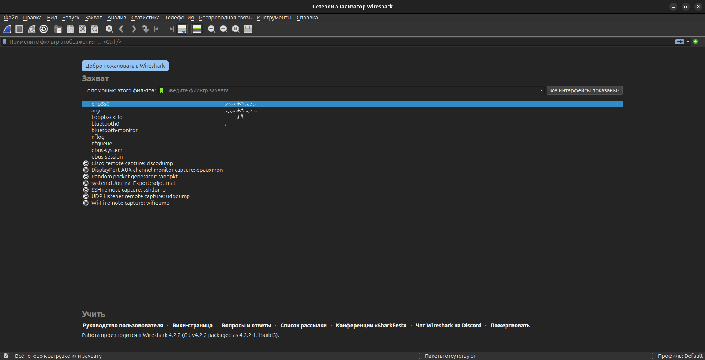
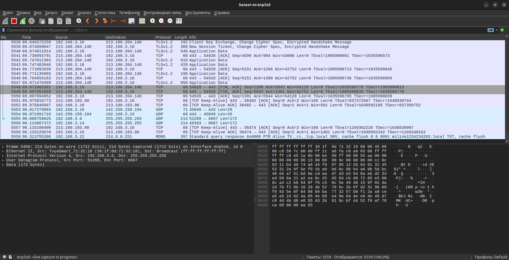
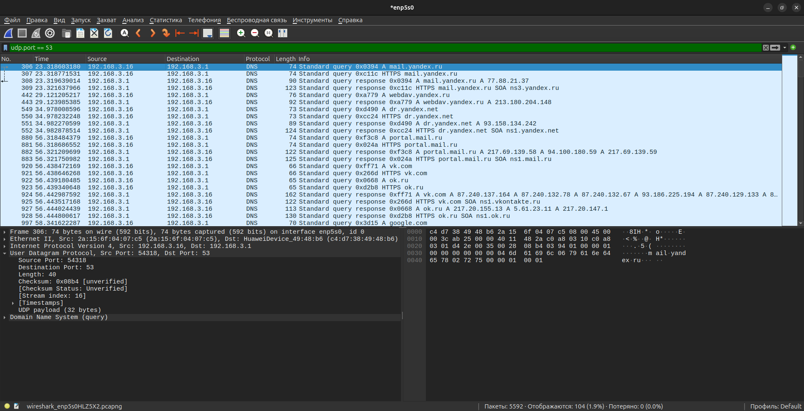

# DevSecOps_Homework_4

## Часть 1. Поиск логов приложения и выделение ошибок.
Для примера было выбрано приложение Steam, установленное в OS Ubuntu.

Логи приложения хранятся по адресу: /home/andrey_lobachev/.steam/steam/logs/console-linux.txt

Логи ошибок были выведены и отфильтрованы при помощи команды: 

`cat /home/andrey_lobachev/.steam/steam/logs/console-linux.txt | grep err | grep "No such file or directory" >> steam_error_log.txt`

При помощи `grep err` были отфильтрованы логи ошибок и отфильтрованные логи ошибок были ещё раз отфильтрованы по типу "Нет файла или директории" командой `grep "No such file or directory"`. Данный тип ошибок возникает, когда приложение при работе не может обратиться к необходимым файлам и / или каталогам. Лог содержит информацию о дате и времени возникновения ошибки, типе ошибки и указании на недостающие библиотеки.

Вывод последовательности команд перенаправлен в текстовый файл: 
[Файл логов - ошибок приложения Steam](/logs/steam_error_log.txt) и сохранён на диске в домашней пользовательской директории.

## Часть 2. Анализ DNS-запросов программой Wireshark

Для анализа сетевого трафика было использовано программное обеспечение Wireshark.

Для анализа трафика был выбран сетевой интерфейс и осуществлён захват пакетов.

Пакеты были отфильтрованы по протоколу UDP и порту 53, на котором по-умолчанию осуществляется вызаимодействие с DNS - сервером.

Из приведённого скриншота видно, что устройство с сетевым адресом Src: 192.168.3.16 с использованием сетевого протокола Internet Protocol Version 4, обращалось к устройству с адресом Dst: 192.168.3.1 для получения информации об IP-адресах интернет-ресурсов: mail.yandex.ru, webdav.yandex.ru, portal.mail.ru, vk.com, google.com и другим.

[Файл трафика, создержащий DNS-запросы](/dump/wireshark-udp-traffic.pcapng)